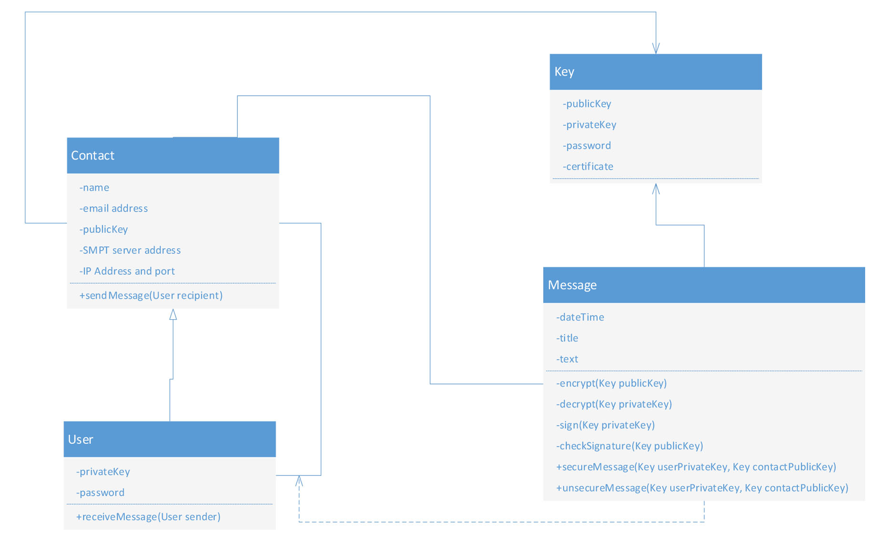
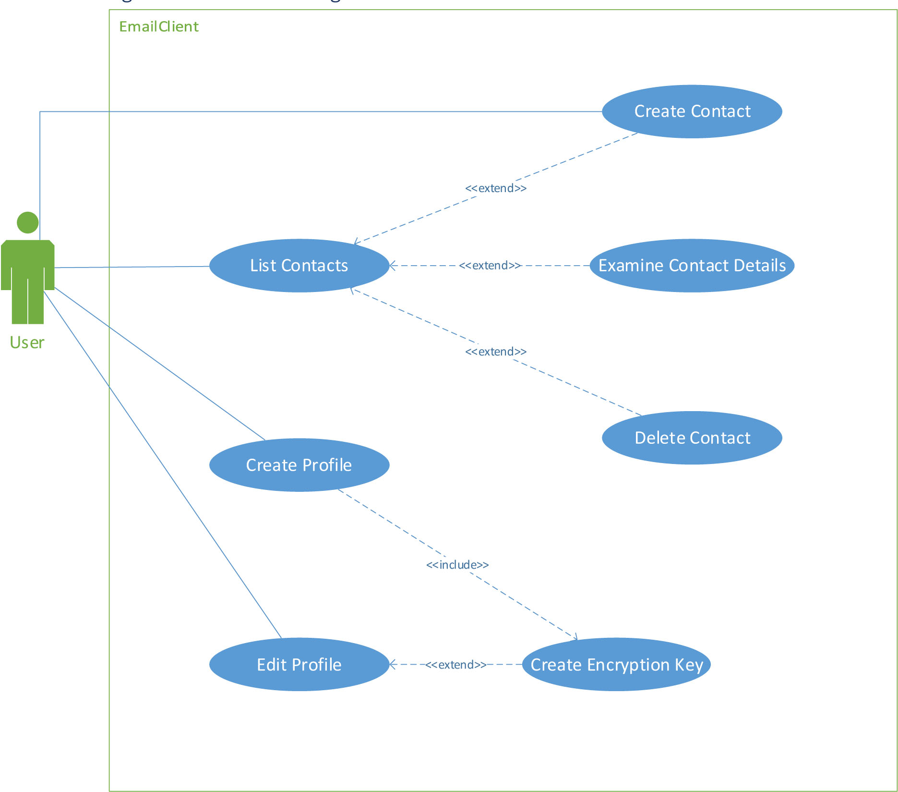
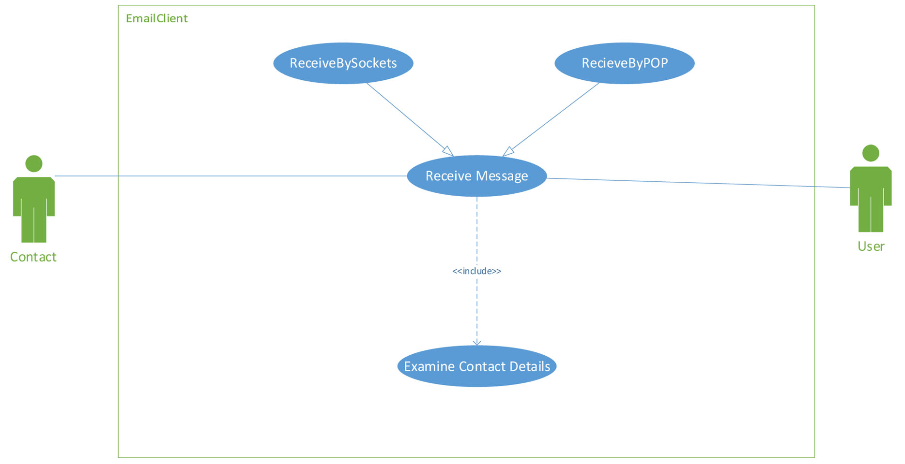

# Safe-Communication
A java application for create a new email client with built-in strong encryption and the option not to use a server as intermediary between two parties communicating.

## Functional Description

A Contact is any person or organization the user wants to exchange messages with (including the user himself/ herself.) Needed to know are at least an email address (functioning as a username as well,) a name and a public key, which is given to the user in the form of a certificate file (see the
description of the encryption to use.) The IP address and port are needed when exchanging messages using sockets, the SMTP address is needed when using SMTP, so at least one of those is required.
User is a Singleton; the software is written for single users. For a user the password and private key are also needed.
Key represents a key for asymmetric encryption, with a public key in a certificate (which can be shared with others), a private key, a password and if needed a salt.
Message (an association class between User and Contact) will in this first version only contain text, other mime types can be added later. A message has a sender and a receiver (we will ignore multiple receivers in this version), a subject (or title), a timestamp when it has been sent, and a body with the text. In the class diagram six methods have been given, of which four are private and are used by the other two.
- When sending a message, it is first signed using the private key of the sender, then encrypted using the public key of the receiver.
- When receiving a message, it is stored on permanent storage (hard disk) in its encrypted form. When reading it the application first decrypts the message using the private key of the 3 user, then decrypts using the public key of the sender. This both verifies confidentiality as well as ensures the sender indeed was the contact (if not the message will be garbled.)

## Use Case Diagram – Contact Management

### The application has the following menu options:
- Editing the user’s profile. When no profile has been made this becomes creating a profile. In the profile the user sets his email address, name, IP Address and port, SMTP server and creates a certificate with password and private key.
- Showing a list of contacts. No editing functionality is needed here, only the option to delete a contact.
- Create a new contact, giving the name, either the IP Address and port, the SMTP server or both, and giving the location of the certificate file. You can either have a file picker here or just have the user enter the directory as a string.

## Use Case Diagram - Reading and sending messages

The application has a list of messages showing only title and timestamp. When selecting a message in the list, details are shown (please do not use a new screen popping up here!)
When creating a message the user sets the title and text himself. The application adds the timestamp
### When Sending. Before sending the message is encrypted as follows:
- Sign the message by encrypting it with the private key of the sender
- Prepend this message by the name of the sender. This is necessary to tell the receiver whose key to use in decrypting.
- Encrypt the message using the public key of the receiver.
The following part happens in a background thread. First try setting up a connection with the receiver using network sockets. If that works send the message over this connection, making sure not to block him for multiple senders. If there is no connection possible, send the message using SMTP.

## Use Case Diagram – Receiving Messages

### The application should listen on the network port configured in the profile. When receiving a message there it:
- Stores the message to disk in its encrypted form
- Starts a background thread to unencrypt
- **In this background thread:**
  - The message is decrypted using the private key of the user
  - The result starts with the username of the sender. Get his public key from the contact list and use that to decrypt the message
  - Store the resulting message in the list of messages which can be shown.
Once every ten minutes the application connects to the POP server to check for messages there. I there are, use POP3 to retrieve them. Decrypt them the same wat as when receiving over sockets.

## Architecture
The encryption used is provided by the BouncyCastle libraries.
For more information please visit : https://www.baeldung.com/java-bouncy-castle

